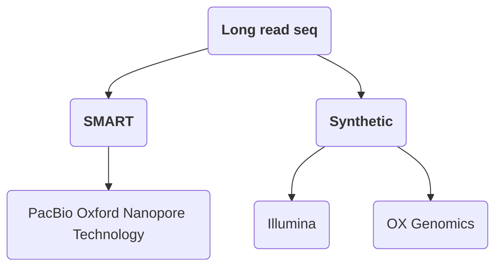
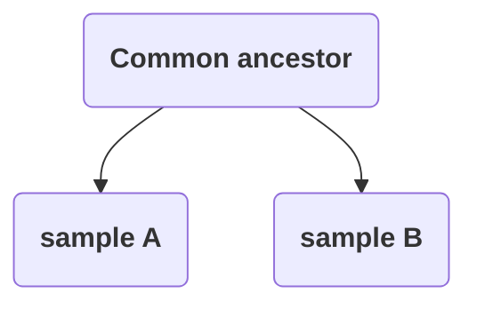

# Ecological Genomics Notebook  

## Author: Erika Bueno  
### Affiliation: University of Vermont
### E-mail contact: embueno@uvm.edu


### Start Date: 2020-01-13
### End Date: 2020-05-08
### Project Descriptions:   


# Table of Contents:   
* [Entry 1: 2020-01-13, Monday](#id-section1)
* [Entry 2: 2020-01-14, Tuesday](#id-section2)
* [Entry 3: 2020-01-15, Wednesday](#id-section3)
* [Entry 4: 2020-01-16, Thursday](#id-section4)
* [Entry 5: 2020-01-17, Friday](#id-section5)
* [Entry 6: 2020-01-20, Monday](#id-section6)
* [Entry 7: 2020-01-21, Tuesday](#id-section7)
* [Entry 8: 2020-01-22, Wednesday](#id-section8)
* [Entry 9: 2020-01-23, Thursday](#id-section9)
* [Entry 10: 2020-01-24, Friday](#id-section10)
* [Entry 11: 2020-01-27, Monday](#id-section11)
* [Entry 12: 2020-01-28, Tuesday](#id-section12)
* [Entry 13: 2020-01-29, Wednesday](#id-section13)
* [Entry 14: 2020-01-30, Thursday](#id-section14)
* [Entry 15: 2020-01-31, Friday](#id-section15)
* [Entry 16: 2020-02-03, Monday](#id-section16)
* [Entry 17: 2020-02-04, Tuesday](#id-section17)
* [Entry 18: 2020-02-05, Wednesday](#id-section18)
* [Entry 19: 2020-02-06, Thursday](#id-section19)
* [Entry 20: 2020-02-07, Friday](#id-section20)
* [Entry 21: 2020-02-10, Monday](#id-section21)
* [Entry 22: 2020-02-11, Tuesday](#id-section22)
* [Entry 23: 2020-02-12, Wednesday](#id-section23)
* [Entry 24: 2020-02-13, Thursday](#id-section24)
* [Entry 25: 2020-02-14, Friday](#id-section25)
* [Entry 26: 2020-02-17, Monday](#id-section26)
* [Entry 27: 2020-02-18, Tuesday](#id-section27)
* [Entry 28: 2020-02-19, Wednesday](#id-section28)
* [Entry 29: 2020-02-20, Thursday](#id-section29)
* [Entry 30: 2020-02-21, Friday](#id-section30)
* [Entry 31: 2020-02-24, Monday](#id-section31)
* [Entry 32: 2020-02-25, Tuesday](#id-section32)
* [Entry 33: 2020-02-26, Wednesday](#id-section33)
* [Entry 34: 2020-02-27, Thursday](#id-section34)
* [Entry 35: 2020-02-28, Friday](#id-section35)
* [Entry 36: 2020-03-02, Monday](#id-section36)
* [Entry 37: 2020-03-03, Tuesday](#id-section37)
* [Entry 38: 2020-03-04, Wednesday](#id-section38)
* [Entry 39: 2020-03-05, Thursday](#id-section39)
* [Entry 40: 2020-03-06, Friday](#id-section40)
* [Entry 41: 2020-03-09, Monday](#id-section41)
* [Entry 42: 2020-03-10, Tuesday](#id-section42)
* [Entry 43: 2020-03-11, Wednesday](#id-section43)
* [Entry 44: 2020-03-12, Thursday](#id-section44)
* [Entry 45: 2020-03-13, Friday](#id-section45)
* [Entry 46: 2020-03-16, Monday](#id-section46)
* [Entry 47: 2020-03-17, Tuesday](#id-section47)
* [Entry 48: 2020-03-18, Wednesday](#id-section48)
* [Entry 49: 2020-03-19, Thursday](#id-section49)
* [Entry 50: 2020-03-20, Friday](#id-section50)
* [Entry 51: 2020-03-23, Monday](#id-section51)
* [Entry 52: 2020-03-24, Tuesday](#id-section52)
* [Entry 53: 2020-03-25, Wednesday](#id-section53)
* [Entry 54: 2020-03-26, Thursday](#id-section54)
* [Entry 55: 2020-03-27, Friday](#id-section55)
* [Entry 56: 2020-03-30, Monday](#id-section56)
* [Entry 57: 2020-03-31, Tuesday](#id-section57)
* [Entry 58: 2020-04-01, Wednesday](#id-section58)
* [Entry 59: 2020-04-02, Thursday](#id-section59)
* [Entry 60: 2020-04-03, Friday](#id-section60)
* [Entry 61: 2020-04-06, Monday](#id-section61)
* [Entry 62: 2020-04-07, Tuesday](#id-section62)
* [Entry 63: 2020-04-08, Wednesday](#id-section63)
* [Entry 64: 2020-04-09, Thursday](#id-section64)
* [Entry 65: 2020-04-10, Friday](#id-section65)
* [Entry 66: 2020-04-13, Monday](#id-section66)
* [Entry 67: 2020-04-14, Tuesday](#id-section67)
* [Entry 68: 2020-04-15, Wednesday](#id-section68)
* [Entry 69: 2020-04-16, Thursday](#id-section69)
* [Entry 70: 2020-04-17, Friday](#id-section70)
* [Entry 71: 2020-04-20, Monday](#id-section71)
* [Entry 72: 2020-04-21, Tuesday](#id-section72)
* [Entry 73: 2020-04-22, Wednesday](#id-section73)
* [Entry 74: 2020-04-23, Thursday](#id-section74)
* [Entry 75: 2020-04-24, Friday](#id-section75)
* [Entry 76: 2020-04-27, Monday](#id-section76)
* [Entry 77: 2020-04-28, Tuesday](#id-section77)
* [Entry 78: 2020-04-29, Wednesday](#id-section78)
* [Entry 79: 2020-04-30, Thursday](#id-section79)
* [Entry 80: 2020-05-01, Friday](#id-section80)
* [Entry 81: 2020-05-04, Monday](#id-section81)
* [Entry 82: 2020-05-05, Tuesday](#id-section82)
* [Entry 83: 2020-05-06, Wednesday](#id-section83)
* [Entry 84: 2020-05-07, Thursday](#id-section84)
* [Entry 85: 2020-05-08, Friday](#id-section85)

------
<div id='id-section1'/>   
### Entry 1: 2020-01-13, Monday.   

Today we discussed the definition of Ecological genomics and how it relates to the history of population genetics. Specifically, I learned about the founders of population genetics (Seawall Wright, R.A. Fisher, J.B.S. Haldane) and their contributions to the field. For example, Wright's island model is used to predict how subpopulations "represented by islands" may behave assuming population size is the same and always stable (don't grow or decline).


Notes: Key points from lecture

Fixation coefficient (Fst)- a measure differentiation among populations. 

* Fst values range from 0-1
  * High Fst value close to 1 infer that the population is highly differentiated (high variability) 
  * Values closer to 0 infer low differentiation
  * High values are associated with less migration (gene flow) and non-random mating

Selection sweeps- occurs when an allele becomes more frequent in the population- we can infer that this allele confers a beneficial trait.

Molecular evolution- "history encoded in DNA" can be examined at different levels

1. Populations
2. Organisms
3. Species

Kimura's Neutral Theory of Molecular Evolution- estimates the probability of a new mutation in a population (N)
$$
1/2N= μ
$$
Synonymous vs non-synonymous mutations-

* Synonymous mutations- does not alter the amino acid in the protein

* Non-synonymous mutations- alters the amino acid in the protein
  $$
  dN/dS
  $$
  N mutations/non syn. sites/ N of syn./ N of syn sites

  w= dN/dS 

  w>>1 or w>2 signal for positive selection

  w = 1 neutral

  w<< 1 negative "purifying selection"

Tajima's D-  𝜋 /s

ratio of nucleotide diversity ( 𝜋 )

no. of segregating sites (s)

High  𝜋  with rare variants in population


------
<div id='id-section3'/>   
### Entry 2: 2020-01-15, Wednesday.   

Lecture notes: How do the questions tie in with the technology?

Things to consider: type organism/sample (tissue, environment, DNA, RNA)

Does the organism have a reference genome? How large is the genome? 

**Library preps**

1. **Whole-genome sequencing**

2. **RNAseq**

3. **Exome Capture**-  not a measurement of expression; focused on examining variation

   Exon- protein coding regions in DNA

   Exome - portion of the genome that codes for exons

   Biomedical uses- disease causing variants/rare diseases

   Ecological and evolutionary- genetic mapping of phenotypic traits, IDing causing variants, detecting selection in a genome

   Cost effective and allows one to beyond model taxa

   Information on life history strategies and molecular markers for evolution

   **Library prep:**

   1. Sample collection
   2. Fragmentation- "fragmented soup" blunt ends created, fragments same length, adenine tails added
   3. Enrichment of libraries- pull DNA and add probes 
      1. PCR- good for 100s loci, low cost, per probe cost is high
      2. De novo- good 100-1000 loci, high cost, per probe cost intermediate
      3. Divergent annotated genome- good for 100-1000s loci, cost per probe low,
   4. Purification
   5. Quality control

4. **RAD/GBS:** 

   RADseq: restriction site associated DNA seq.

   ​	Uses APK1- enzyme (restriction enzyme "cuts" palindromic sites) allows for barcode attachment

   Library prep:

   1. Genomic DNA
   2. Digest with 1 restriction enzyme
   3. Ligate adapters to fragments
   4. Multiplex (pool) samples
   5. PCR- allele drop-off issues-> PCR amplification does not work or cut site because of an existing variant thus reducing the amount of DNA being seq.

5. **Amplicon seq**- sequencing singular fragment of DNA- often highly conserved

   1. 16s RNA for bacteria
   2. ITS for fungi
   3. CO1 for animals

   **Library prep**

   1. DNA isolation
   2. PCR - amplify product of interest
   3. Add adapters- for barcoding
   4. Sequence

6. **Bisulfite seq: Identifies  methylated C's in genome.** 

   CG islands: GCGCGCGC - usually in non-coding DNA or promoter regions of a gene

   Library prep:

   1. Isolate DNA
   2. Treatment with bisulfite- converts methylated cytosine with a uracil
   3. PCR- amplify 
   4. Sequence treated samples
   5. Compare to untreated samples

CHIPseq: chromatin immunoprecipitation

Library prep:

1. Add fixative to fix all proteins attached to DNA
2. Immunoprecipitation: introduce an antibody that is specific to protein of interest
3. Sequence- data tells you where histone modifications are located

ATAC seq: Chromatin accesibility

"Tagementation": tagging probes + fragmenting DNA

1. Introduce a manufactured TE to fragment DNA
2. Load fragments into sequencer 
3. (HiSeq)
4. Global 3-D shape of the genome- crosslinks all touching DNA, only fragment those crosslinked DNA

**Sequencing platforms**

Illumina- for short read sequencing

sequencing: decoding nucleotide molecules

NGS- faster and cheaper

* Four step process:
  	1. Library prep: DNA fragmentation, attaching adapters
   	2. Cluster generation: lawn- contains complementary adapters + DNA polymerase + bases (ATCG) = creates clusters
   	3. Sequencing by synthesis: oligo's + fluorescent dNTPs = fluorescent signal is measured by the machine
   	4. Data analysis: filtering and mapping to reference genome

PacBio/Nanopore- long read sequencing

Long read seq: 



PacBio- small well set up where single DNA fragment foes in and polymerized

* dNTPs + fluorophores -> lasers and camera

Synthetic- wells (Illumina) vs emulsion based (OX genomics)

------
<div id='id-section8'/>   
### Entry 3: 2020-01-22, Wednesday.   

**Population genomics**

​	Why is it used? allows one to infer selection and drift across the genome

-Population genetics does not incorporate the genomic landscape and structure

-The effects of environmental changes can be tracked via changes in abundance and distribution (demographics) as well as changes in selection pressures- "potential to adapt"

Challenges: teasing apart demographic history from effects of selection

Why do population genomics?

-genomic environment is inherently variable

-allows one to statistically capture the variation with dense sequencing

-population genetic approaches miss out total variation because of limited sampling

**Linkage disequilibrium**- caused by physical distance due to crossover events

1) **genomic context:** selection acts on the genome locally while drift acts on the genome globally

* mean and distribution used to infer drift and small population size

* outliers allows one to infer selection

* small population size and drift act on the entire genome

**2) Demographic history**

Ne- effective population size

* behaves as a Wright-Fisher population
* idealized population; every individual has same probability of mating
* migration (gene flow) among populations (groups of individuals exchanging genes)
* divergence - times between populations

**Coalescent theory**- probability of allele copies share a common ancestor

2N allele copies in a population of Ne individuals

1/2Ne= probability of a common ancestor

* stochastic process- sample multiple alleles copies not just one to tease out variability
* MRCA- Most recent common ancestor of all allele copies
* Population bottlenecks change the rate coalescent events 
* Rate speeds up during population bottlenecks and slows down with expansion
* inferring drift based on models of coalescence
* adding mutations to find derived alleles in population

Bottlenecks- loose rare alleles and maintain common ones

Site frequency spectrum (SFS)- histogram of allele frequencies for many SNPs in a population

3) **Selection**- positive selection increases frequency of beneficial allele/variant

* nucleotide diversity- average pairwise differences between individuals
* low nucleotide diversity under positive selection
* linkage measures- increase near selected sites due to genetic hitchhiking
* cause exact same expansion in tree "bushy trees" as bottleneck but only locally- selective sweep



------
<div id='id-section11'/>   
### Entry 4: 2020-01-27, Monday.   


------
<div id='id-section13'/>   
### Entry 5: 2020-01-29, Wednesday.   

Lecture notes: What's the difference between Rmd vs md?

* markdown a type of language that renders it into something readable

* inserting web links: [TEXT](URL)

* numbered lists: 1. TEXT

* embedding code: ``` LINE BREAK ```

  ``` cd ~/mydata```

* This is where the class data are: ` /data/project.data`
* two windows: notebook open and terminal
* pbio381.uvm.edu server name

Learning objectives

* background on species
* understand the pipeline
* bash scripts
* sequencing quality assessment
* mapping to ref genome

Red spruce- cool moist climates, northerly distributed, higher in elevation as you move south.

* genetic basis of climate adaptation
* highly fragmented populations
* alleles that might be potentially conserved
* inform nature conservancy to improve restoration management practices for red spruce

Genomic DNA from needles (110 mother trees; 23 populations)

* ref genome based on multiple tissues and developmental stages in related species white spruce
* 80,000 probes were designed based on these transcriptomes (120 bp)
* coverage of at least one probe for 38,570 unigenes (90 bp, 85% coverage)
* fragmentation, hybridization with probes, sequenced on a Hiseq X to generate paired end 150 bp reads.
  * single end only one end is paired
  * paired ends two ends are sequenced- more powerful than single end

Pipeline

1. fastq files- compressed files containing reads 
   1. often zipped in a fastq.gz
2. visualize with fastQC- assess quality
3.  trimmed .fastq - trimmomatic- visualize again with fastQC
4. map or align those reads to ref genome with BWA (.sam)
5. post processing- samtools (.bam)
   1. look for PCR duplicates- avoiding pseudoreplication by getting rid of duplicate reads
   2. generate stats around depth and quality for each sample

`cd /data/project_data/RS_ExomeSeq//fastq/edge_fastq/`

naming- population code_mother tree_read direction_file ext

compressed .gz format- cant use head code`

`zcat FILE | head -n 4` #first four lines

metadata about run

`@GWNJ-0842:368:GW1809211440:2:1101:18355:2170 2:N:0:NCGTATCA+NTTCGCCT
NACAGAATTAATTTCATGGGAGAGCAAATGTACGTAACTAGGAAAATTTAAAGGGCTGTATGCACCCATATCCTCCTCATCCTCATAAGCATCATCAACAGATATGATAGGAAGAATTATGCCAGTTACAAGCTAGAACCCTCCCTTTTT
+
#AA<7A-A-AJA--<F--7F---7--<-<----<F----<-7--<<FFJ--<F-<--7--<F7-FJ<AF-A777<<F--<FF<-F--<-7-F-AFF<-F-<A-7-77-7A<F-7<-7<-77F-F<<F<-FFFJ-------)-)))77-AF`

1. information on which machine
2. barcode sequence
3. sequence (including any N's)
4. separator is a plus sign
5. ASCI representation of the quality of the read

Phred quality scores- 0-40: what's the probability that the machine read the correct nucleotide

p = 10 ^-38/10

= 10^-3.8

p= 0.0038 # probability that the correct nucleotide was called

Running fastQC -for CRA individuals

usually the text files get redirected to local machine- for this example were redirectiong to shared space

`repo`

my scripts - vim- press i (active edit mode) - #!/bin/bash #language info 

`cd ~/EcolGenomics/myresults/ #where we are saving the fastqc results
mkdir fastqc` #making the folder where it will save

creating a for loop

`for file in /data/project_data/RS_ExomeSeq/fastq/edge_fastq/CRA*fastq.gz`

do

`fastqc ${file} -o fastqc`

done

shift + colon 

:wq fastqc.sh #bash script saved in  myscripts and exit the vim

fix permission to run the script

`chmod u+x` #an X should appear now

`bash fastqc.sh`

it should run git

git pull after

results- basic statistics

```
git pull
git add --all 
git commit -m "note"
git push
```

Trimming our reads with Trimmomatic

`cd /data/scripts`

`cp trim_loop.sh  /Ecolgenomics/myscripts/`

`vim trimm_loop.sh`

edit script for individual population

`cd /data/project_data/RS_ExomeSeq/fastq/edge_fastq

for R1 in CRA*R1_fastq.gz

do

        R2=${R1/_R1_fastq.gz/_R2_fastq.gz}
        f=${R1/_R1_fastq.gz/}
        name=`basename ${f}`
    
        java -classpath /data/popgen/Trimmomatic-0.33/trimmomatic-0.33.jar org.usadellab.trimmomatic.TrimmomaticPE \
        -threads 1 \
        -phred33 \
         "$R1" \
         "$R2" \
         /data/project_data/RS_ExomeSeq/fastq/edge_fastq/pairedcleanreads/${name}_R1.cl.pd.fq \
         /data/project_data/RS_ExomeSeq/fastq/edge_fastq/unpairedcleanreads/${name}_R1.cl.un.fq \
         /data/project_data/RS_ExomeSeq/fastq/edge_fastq/pairedcleanreads/${name}_R2.cl.pd.fq \
         /data/project_data/RS_ExomeSeq/fastq/edge_fastq/unpairedcleanreads/${name}_R2.cl.un.fq \
        ILLUMINACLIP:/data/popgen/Trimmomatic-0.33/adapters/TruSeq3-PE.fa:2:30:10 \
        LEADING:20 \
        TRAILING:20 \
        SLIDINGWINDOW:6:20 \
        MINLEN:35

escape + :wq  #escaping vim mode

`bash trim_loop.sh ` #runs the program

**HW: run fastqc on our trimmed sequences- cleaned paired reads for R1 and R2 ONLY**

location of cleaned reads:

`/data/project_data/RS_ExomeSeq/fastq/edge_fastq/pairedcleanreads/ `

------
<div id='id-section16'/>   
### Entry 16: 2020-02-03, Monday.  

Paper:

Notes:

**Fst**- a measure of genetic structure developed by Sewall Wright (1969, 1978). Related to statistical analysis of variance (*ANOVA)* 

[Source]: https://www.uwyo.edu/dbmcd/popecol/maylects/popgengloss.html

*F*ST is the proportion of the total genetic variance contained in a subpopulation (the S subscript) relative to the total genetic variance (the *T* subscript). 

* Values can range from 0 to 1. High *F*ST implies a considerable degree of differentiation among populations.

**Selective Sweeps -** When a new beneficial mutation is positively selected for and a reduction or elimination of variation is observed as a result. 

* Hard sweep- typically result from rapid emergence of mutations. 
* Soft sweeps are a result of selection on a allele that is carried by multiple individuals in a population.

**Admixture**: Gene flow between two populations that are genetically differentiated, involves gene flow in both directions. Admixture can be plotted with a population structure plot, which allows one to identify the number of genetically differentiated groups in a population and the amount of admixture between the groups.

**Tajima’s D** (aka as a neutrality test) is commonly used in population genetics to determine whether a DNA sequence evolved from random processes (mutation and genetic drift) or through non-random processes (i.e. directional selection, genetic hitchhiking, introgression, etc.). It is calculated by subtracting the difference between the observed variation and the expected variation in a population. 

* A negative Tajima’s D means that genetic variation is being reduced through population expansion (i.e. recovering from small pop size) or a selective sweep (decreases variation). 
* A positive Tajima’s D suggests that genetic variation is being maintained by balancing selection or a recent population contraction.

Info session notes: Genomic diversity 

Effective population size: size of an ideal population that conforms to Wright-Fisher assumptions.

* Factors deviating Ne from N

  * non-random mating, unequal sex ratio, selection, reproductive skew, constant population size

* Seawall Wright Ne= 4Nmales x Nfemales/ Nmales + Nfemales (founded upon this equation on sex ratios)

* can be estimated by pie = Ne*u (net probability of Ne times mutation rate)

* mutation rate-units change per time per generation

* Nei's genetic distance- measurement of diversity

* Fst- population structure- 1/ pie +1 or 1 - avg H of subpop/ H for whole pop (H - heterozygosity)

* Site frequency spectrum- number of individuals (frequency) plotted against number of differentiated SNPS (polymorphisms) 

  

Frequency of rare alleles in a population. With population expansion, Ne increases, and the frequency of rare alleles will increase in a few number of individuals.

Fst = 1- pieS/pieT


------
<div id='id-section18'/>   
### Entry 18: 2020-02-05, Wednesday.  

Notes:


 

------
<div id='id-section21'/>   
### Entry 21: 2020-02-10, Monday.   


------
<div id='id-section23'/>   
### Entry 23: 2020-02-12, Wednesday

------
<div id='id-section26'/>   
### Entry 26: 2020-02-17, Monday.

------
<div id='id-section28'/>   
### Entry 28: 2020-02-19, Wednesday.   


------
<div id='id-section30'/>   
### Entry 30: 2020-02-21, Friday.   


------
<div id='id-section31'/>   
### Entry 31: 2020-02-24, Monday.   


------
<div id='id-section32'/>   
### Entry 32: 2020-02-25, Tuesday.   


------
<div id='id-section33'/>   
### Entry 33: 2020-02-26, Wednesday.   


------
<div id='id-section34'/>   
### Entry 34: 2020-02-27, Thursday.   


------
<div id='id-section35'/>   
### Entry 35: 2020-02-28, Friday.   


------
<div id='id-section36'/>   
### Entry 36: 2020-03-02, Monday.   


------
<div id='id-section37'/>   
### Entry 37: 2020-03-03, Tuesday.   


------
<div id='id-section38'/>   
### Entry 38: 2020-03-04, Wednesday.   


------
<div id='id-section39'/>   
### Entry 39: 2020-03-05, Thursday.   


------
<div id='id-section40'/>   
### Entry 40: 2020-03-06, Friday.   


------
<div id='id-section41'/>   
### Entry 41: 2020-03-09, Monday.   


------
<div id='id-section42'/>   
### Entry 42: 2020-03-10, Tuesday.   


------
<div id='id-section43'/>   
### Entry 43: 2020-03-11, Wednesday.   


------
<div id='id-section44'/>   
### Entry 44: 2020-03-12, Thursday.   


------
<div id='id-section45'/>   
### Entry 45: 2020-03-13, Friday.   


------
<div id='id-section46'/>   
### Entry 46: 2020-03-16, Monday.   


------
<div id='id-section47'/>   
### Entry 47: 2020-03-17, Tuesday.   


------
<div id='id-section48'/>   
### Entry 48: 2020-03-18, Wednesday.   


------
<div id='id-section49'/>   
### Entry 49: 2020-03-19, Thursday.   


------
<div id='id-section50'/>   
### Entry 50: 2020-03-20, Friday.   


------
<div id='id-section51'/>   
### Entry 51: 2020-03-23, Monday.   


------
<div id='id-section52'/>   
### Entry 52: 2020-03-24, Tuesday.   


------
<div id='id-section53'/>   
### Entry 53: 2020-03-25, Wednesday.   


------
<div id='id-section54'/>   
### Entry 54: 2020-03-26, Thursday.   


------
<div id='id-section55'/>   
### Entry 55: 2020-03-27, Friday.   


------
<div id='id-section56'/>   
### Entry 56: 2020-03-30, Monday.   


------
<div id='id-section57'/>   
### Entry 57: 2020-03-31, Tuesday.   


------
<div id='id-section58'/>   
### Entry 58: 2020-04-01, Wednesday.   


------
<div id='id-section59'/>   
### Entry 59: 2020-04-02, Thursday.   


------
<div id='id-section60'/>   
### Entry 60: 2020-04-03, Friday.   


------
<div id='id-section61'/>   
### Entry 61: 2020-04-06, Monday.   


------
<div id='id-section62'/>   
### Entry 62: 2020-04-07, Tuesday.   


------
<div id='id-section63'/>   
### Entry 63: 2020-04-08, Wednesday.   


------
<div id='id-section64'/>   
### Entry 64: 2020-04-09, Thursday.   


------
<div id='id-section65'/>   
### Entry 65: 2020-04-10, Friday.   


------
<div id='id-section66'/>   
### Entry 66: 2020-04-13, Monday.   


------
<div id='id-section67'/>   
### Entry 67: 2020-04-14, Tuesday.   


------
<div id='id-section68'/>   
### Entry 68: 2020-04-15, Wednesday.   


------
<div id='id-section69'/>   
### Entry 69: 2020-04-16, Thursday.   


------
<div id='id-section70'/>   
### Entry 70: 2020-04-17, Friday.   


------
<div id='id-section71'/>   
### Entry 71: 2020-04-20, Monday.   


------
<div id='id-section72'/>   
### Entry 72: 2020-04-21, Tuesday.   


------
<div id='id-section73'/>   
### Entry 73: 2020-04-22, Wednesday.   


------
<div id='id-section74'/>   
### Entry 74: 2020-04-23, Thursday.   


------
<div id='id-section75'/>   
### Entry 75: 2020-04-24, Friday.   


------
<div id='id-section76'/>   
### Entry 76: 2020-04-27, Monday.   


------
<div id='id-section77'/>   
### Entry 77: 2020-04-28, Tuesday.   


------
<div id='id-section78'/>   
### Entry 78: 2020-04-29, Wednesday.   


------
<div id='id-section79'/>   
### Entry 79: 2020-04-30, Thursday.   


------
<div id='id-section80'/>   
### Entry 80: 2020-05-01, Friday.   


------
<div id='id-section81'/>   
### Entry 81: 2020-05-04, Monday.   


------
<div id='id-section82'/>   
### Entry 82: 2020-05-05, Tuesday.   


------
<div id='id-section83'/>   
### Entry 83: 2020-05-06, Wednesday.   


------
<div id='id-section84'/>   
### Entry 84: 2020-05-07, Thursday.   


------
<div id='id-section85'/>   
### Entry 85: 2020-05-08, Friday.   


